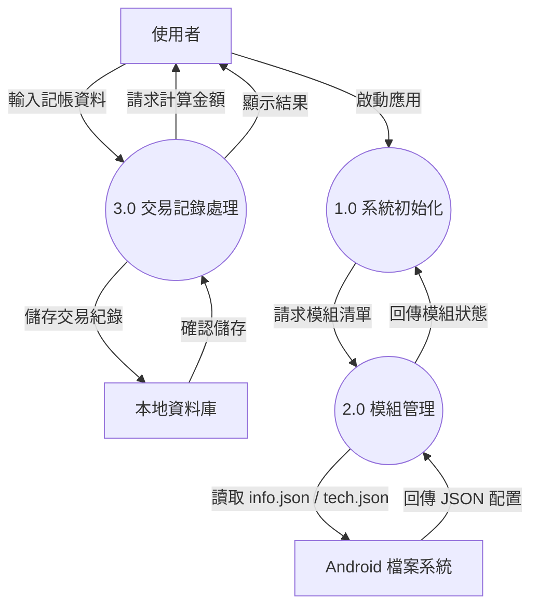

# 系統環境圖 (Data Flow Diagram)

「模組化記帳系統」的資料流向與程序邏輯。

## 1. 系統環境圖 (Context Diagram)

### 外部實體 (External Entities)

- **使用者 (User)**：進行記帳、查看報表、設定模組的人員。
- **Android 檔案系統 (File System)**：儲存模組設定檔 (info.json, tech.json) 與 Web 資源 (.html, .js, .css)。
- **本地資料庫 (Local Database)**：儲存記帳數據 (ExpenseDao)。

### 主要程序 (Processes)

- **系統初始化 (System Initialization)**：負責啟動 Runtime、建立橋接器 (Bridge) 與初始化各管理器。
- **模組管理 (Module Management)**：負責讀取模組清單、載入技術配置 (tech.json)、啟用與驗證模組。
- **交易記錄處理 (Transaction Recording)**：負責接收使用者輸入的收支資料、計算金額並儲存至資料庫。

### 資料儲存 (Data Stores)

- **模組配置庫 (Module Configs)**：存放於 Assets 的 JSON 檔案。
- **帳務資料表 (Expense Table)**：存放於 SQLite/Room 的帳務紀錄。

### DFD 圖表 (Mermaid)

