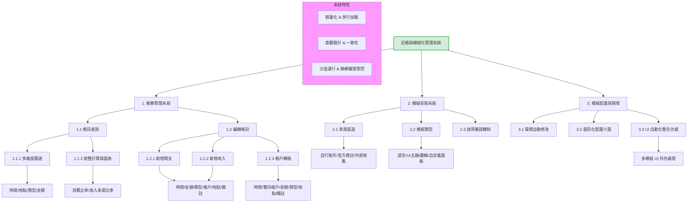

# 功能性需求
### 1. 帳目查詢功能
* 用戶可透過介面查找統整已記錄的帳目。
* 用戶可透過篩選器將帳目做統整和進一步計算。
* 篩選器應該包括：時間、地點、類型、金額查找。
* 計算統整應該包括各類圖表，如某時間段內的消費類型比率、收入來源比率等。
### 2. 編輯帳目功能
* 分為新增開支、收入、轉帳三部分。
* 開支應該有時間、金額、類型、帳戶、地點、備註。
* 收入應該有時間、金額、類型、帳戶、地點、備註。
* 轉帳應該有時間、轉出帳戶、轉出金額、轉入帳戶、類型、地點、備註。
### 3. 模組安裝功能
* 系統本身須支持透過模組修改系統介面和部分邏輯。
* 模組來源自用戶自行製作、我官方商店下載、其他收集方式。
* 模組安裝後，需用戶再次確認模組功能是否符合需求，選擇啟用或未啟用。
* 模組可以有以下類型，語言、UI主題、邏輯、自定義面板。
### 4. 模組配置功能
* 系統將自動按照模組開發者設定的項目修改自身環境。
* 系統將提供模組自帶的圖形化配置區介面，方便用戶調整模組內部的功能模塊。
* UI介面類型的模組，系統也會提供自動化整合功能，使不同模組的相同UI修改需求能同時共存。

# 非功能性需求
### 1. 效能
**響應速度**：系統本身應極具輕量化，確保多模組環境還能保持流暢的運行速度。
**模組加載速度**：系統開始運行模組內容時，應該多加利用併行加載，使用戶能增加更換模組的體驗。

### 2. 可用性與易用性
**操作簡單**：APP 介面設計直觀，有精簡文字說明，使用戶能一目了然各功能模塊。
**介面一致性**：整個 APP 的介面風格和操作流程應保持一致性。
**錯誤訊息清晰**：系統錯誤應以使用者容易理解的方式呈現，並提供解決建議。

### 3. 安全性
**模組運行安全**：系統將模組運行於沙盒環境中，模組不能在未經授權時取得用戶資訊。
**網路安全**：模組沒有聯網能力，只有系統後端能連接我官網用以下載官方授權之模組。

# 功能分解圖

# 使用案例說明
## 1. 帳目查詢與分析
#### 參與者：用戶
#### 簡述：允許用戶查看歷史帳目，並透過篩選器進行統計分析與查看消費圖表。
#### 基本流程：
用戶進入「帳目查詢」頁面。

系統預設顯示當月所有帳目清單。

用戶選擇「篩選器」，設定時間、地點、類型或金額範圍。

系統即時更新清單，並統整篩選後的數據。

用戶切換至「圖表視角」，查看分析結果（如消費比率圓餅圖）。

#### 包含關係（Include）：
在第四步驟，系統執行「數據統計運算」，計算各類別之總和與百分比。

## 2. 編輯帳目功能
#### 參與者：用戶
#### 簡述：用戶可新增、修改或刪除開支、收入與轉帳紀錄。
#### 基本流程：
用戶選擇「新增紀錄」。

用戶選擇類別（開支、收入或轉帳）。

根據選擇類別，用戶輸入對應欄位（如金額、帳戶、地點、備註等）。

用戶點擊「儲存」。

系統驗證欄位格式正確後，更新帳戶餘額並顯示「記錄成功」。

#### 包含關係（Include）：
在第五步驟，系統自動執行「餘額連動更新」，確保轉出與轉入帳戶的數值正確無誤。

## 3. 模組安裝功能
#### 參與者：用戶、系統管理員（官方商店）
#### 簡述：允許用戶從不同來源安裝模組，以擴充系統介面或邏輯。
#### 基本流程：
用戶選擇「模組管理」並瀏覽商店或匯入自製模組。

用戶點擊「安裝」。

系統將模組放入沙盒環境解壓並預覽。

系統跳出確認視窗，要求用戶核對模組功能是否符合預期。

用戶點選「啟用」。

系統載入模組並套用至現有介面。

#### 包含關係（Include）：
在第三步驟，系統強制執行「安全性沙盒掃描」，確保模組無非法網路連線行為。

## 4. 模組配置功能
#### 參與者：用戶
#### 簡述：用戶可透過圖形化介面調整已安裝模組的內部參數。
#### 基本流程：
用戶進入「模組配置」區塊。

選擇特定已啟用的模組（如 UI 主題或自定義面板）。

系統開啟該模組專屬的「圖形化配置介面」。

用戶調整參數（如顏色、邏輯模塊開關）。

用戶點擊「套用變更」。

系統自動整合多個模組的修改需求，確保無衝突並立即呈現效果。

#### 包含關係（Include）：
在第六步驟，系統執行「UI 自動化整合校驗」，防止多個 UI 模組同時修改同一區塊時產生介面崩壞。
