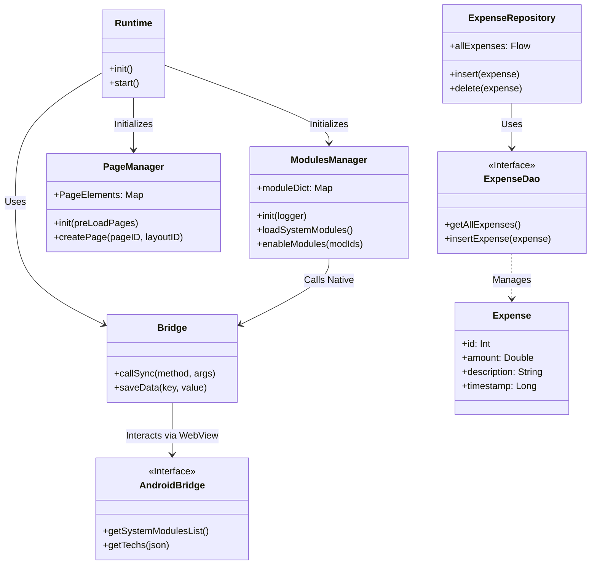
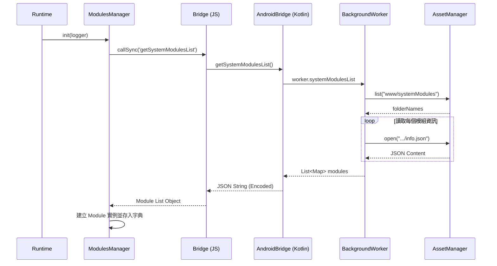
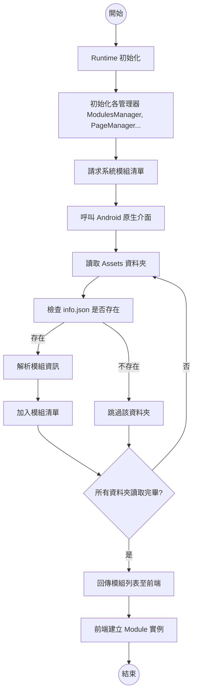
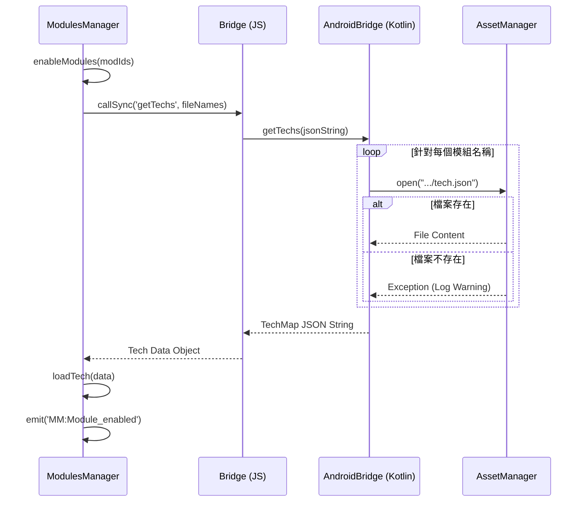
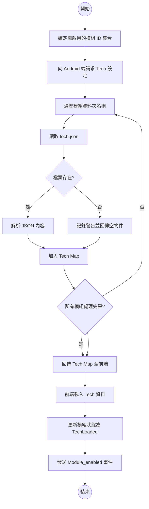
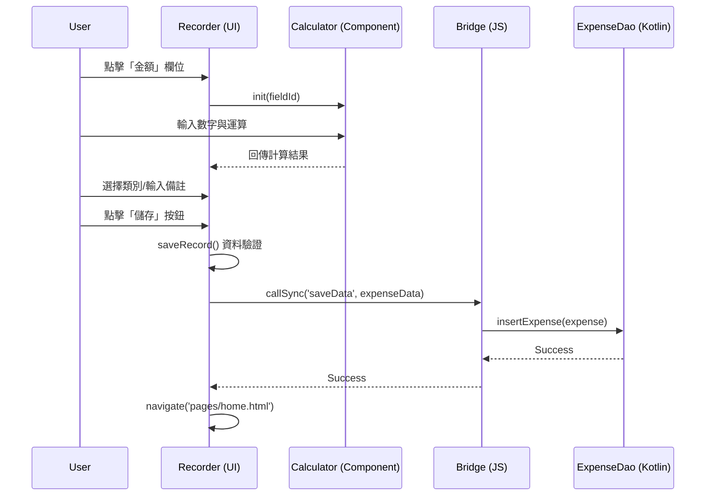
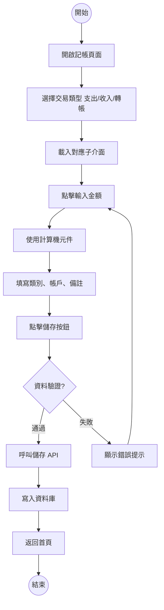

# UML 設計文件 (Class, Sequence & Activity Diagrams)

本文件包含系統類別結構設計,以及針對三個核心使用案例的詳細流程設計。

---

## 1. UML 類別圖 (Class Diagram)

此圖表展示系統核心類別及其互動關係,包含前端管理器、原生橋接層與資料庫存取層。

---

## 2. 使用案例:系統啟動與模組清單載入

**情境:** 應用程式啟動時,Runtime 初始化並透過 ModulesManager 向 Android 原生層請求系統模組清單。

### 循序圖 (Sequence Diagram)

### 活動圖 (Activity Diagram)

---

## 3. 使用案例:啟用模組與讀取技術配置

**情境:** ModulesManager 決定啟用特定模組後,需讀取該模組的 tech.json 以獲取元件與依賴設定。

### 循序圖 (Sequence Diagram)

### 活動圖 (Activity Diagram)

---

## 4. 使用案例:新增一筆記帳紀錄

**情境:** 使用者在 Recorder 介面輸入金額與資訊,並按下儲存按鈕。

### 循序圖 (Sequence Diagram)

### 活動圖 (Activity Diagram)

---