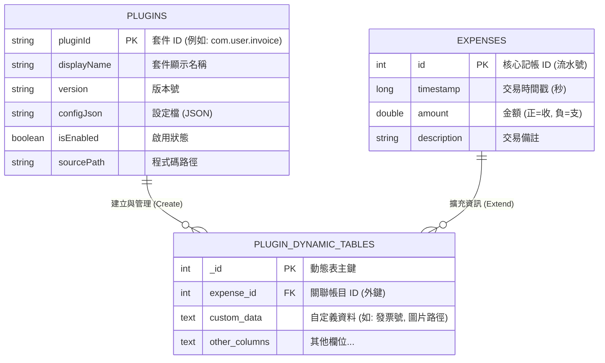

# 實體關係圖 (Entity Relationship Diagram)

模組化記帳系統採用混合式資料架構,結合 Android Room 核心資料庫與外掛模組動態擴充表。

---

## 1. ERD 架構圖



---

## 2. 組合實體範例 (Composite Entities Examples)

本系統使用 `PLUGIN_DYNAMIC_TABLES` 作為通用的擴充載體,但在邏輯上可以自由定義各式組合實體完成所有邏輯，以下為範例內容:

### 1. 電子發票組合實體 (Invoice Entity)

**定義:** 將「核心帳目 (Expense)」與「發票模組 (Invoice Plugin)」結合的實體。

**功能:** 解決核心表欄位固定的限制,讓特定消費紀錄可以掛載發票號碼、賣方統編與載具資訊。

**結構:** 包含外鍵 `expense_id` (指向該筆消費) 與 JSON 資料 `custom_data` (存放發票細節)。

### 2. 圖片附件組合實體 (Receipt Attachment Entity)

**定義:** 核心帳目 + 圖片/相機模組資料。

**功能:** 可以紀錄實體收據或商品照片作為憑證供檢閱。

**結構:** expense_id: 關聯至核心消費紀錄。實作細節可能如下：
```json
custom_data: { "localPath": "/storage/.../img.jpg", "thumbnail": "base64..." }。
```

---